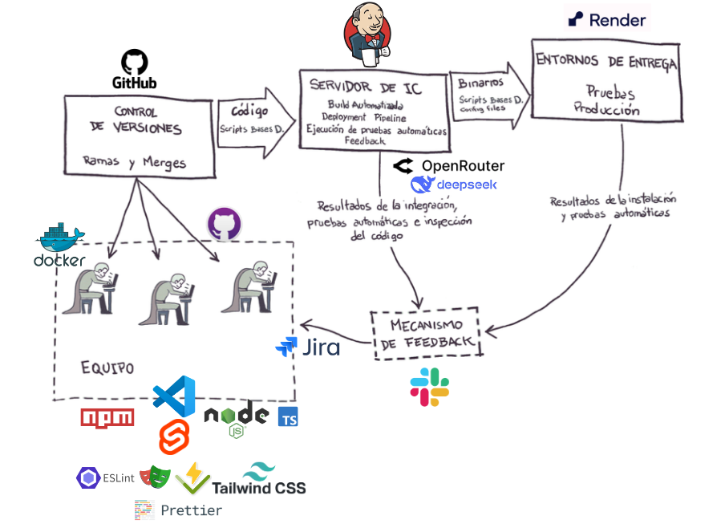

# Proyecto SvelteKit Minimal

## Descripción

Este proyecto está construido con **SvelteKit** minimal, un **framework de interfaz de usuario de Node.js**. Utiliza diversas tecnologías modernas para asegurar un desarrollo eficiente y de alta calidad, implementando pruebas automáticas, integración continua y despliegue en la nube.

## Tecnologías Utilizadas

- **SvelteKit Minimal**: Framework de desarrollo de aplicaciones de interfaz de usuario, construido sobre Node.js.
- **@sveltejs/adapter-node**: Adaptador utilizado para desplegar la aplicación en un servidor Node.js, ideal para entornos de producción.
- **GitHub**: Plataforma utilizada para el control de versiones.
- **Docker**: Herramienta para la gestión de entornos de ejecución.
- **npm**: Gestor de paquetes utilizado para manejar dependencias y scripts.
- **Vite**: Bundler de desarrollo ultrarrápido utilizado para la construcción y desarrollo del proyecto.
- **ViTest**: Framework de pruebas unitarias automáticas.
- **Playwright**: Herramienta para pruebas end-to-end (e2e).
- **EsLint**: Linter para asegurar un código limpio y consistente.
- **TypeScript**: Lenguaje para asegurar la robustez del código.
- **Prettier**: Herramienta de formateo de código para mantener la consistencia.
- **Tailwind CSS**: Framework de CSS para un diseño rápido y personalizable.

## Integración Continua y Despliegue

- **Jenkins**: Se utiliza para la integración continua, donde se automatiza la ejecución de pruebas y la construcción del proyecto.
- **Render**: Plataforma para el despliegue del proyecto en la nube.
  
## Monitoreo de Errores

Se ha integrado **OpenRouter** con **DeepSeek** para proporcionar explicaciones en lenguaje natural sobre los errores de las pruebas. Esto facilita la depuración y mejora la eficiencia durante el desarrollo.